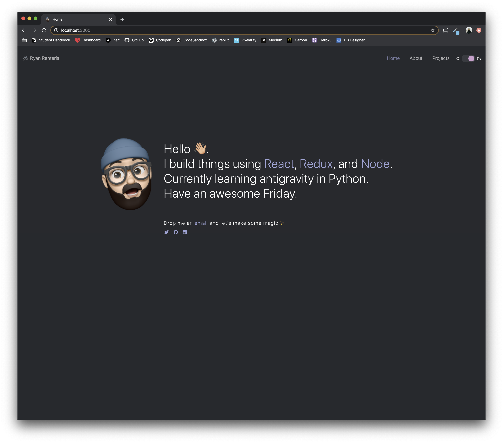

<h1 align="center">hyperreacted.io</h1>
<p align="center">
  The first iteration of <a href="https://hyperreacted.io" target="_blank">hyperreacted.io</a> built with <a href="https://reactjs.org/" target="_blank">React</a> and hosted with <a href="https://vercel.com/blog/zeit-is-now-vercel" target="_blank">ZEIT</a>
</p>



## 🛠 Installation and Set Up

If you'd like to use this as a base for your portfolio, feel free to fork this repo!

1. Install Create-React-App

    ```sh
    npm install -g create-react-app
    ```

2. Install the Zeit CLI

    ```sh
    npm i -g now
    ```

3. Install dependencies

    ```sh
    npm install
    ```

4. Start the development server

    ```sh
    npm start
    ```

## ⚡️ Building for Production

  1. Deploy using now CLI

      ```sh
      now
      ```

  2. If you are running `now` for the first time the Zeit CLI needs to know which scope you want to deploy your directory to. You can choose to either link an existing project or to create a new one.

      ```sh
      $ now
      ? Set up and deploy “~/web/my-rad-project”? [Y/n] y
      ? Which scope do you want to deploy to? My Awesome Team
      ? Link to existing project? [y/N] y
      ? What’s the name of your existing project? my-rad-project
      🔗 Linked to awesome-team/my-rad-project (created .now and added it to .gitignore)
      ```

## 🎨 Colors are based on <a href="https://superhuman.com/" target="_blank">Superhuman</a> and provided as a reference below

| Color          | Hex                                                                |
| -------------- | ------------------------------------------------------------------ |
| Surface        |  `#27292d` |
| Base           |  `#1F2023` |
| Overflow       |  `#010101` |
| Lilac          |  `#CE9ECE` |
| Sunglow        |  `#FFCA33` |
| Seagull        |  `#72C0EA` |
| Cold Purple    |  `#A0A4D9` |


